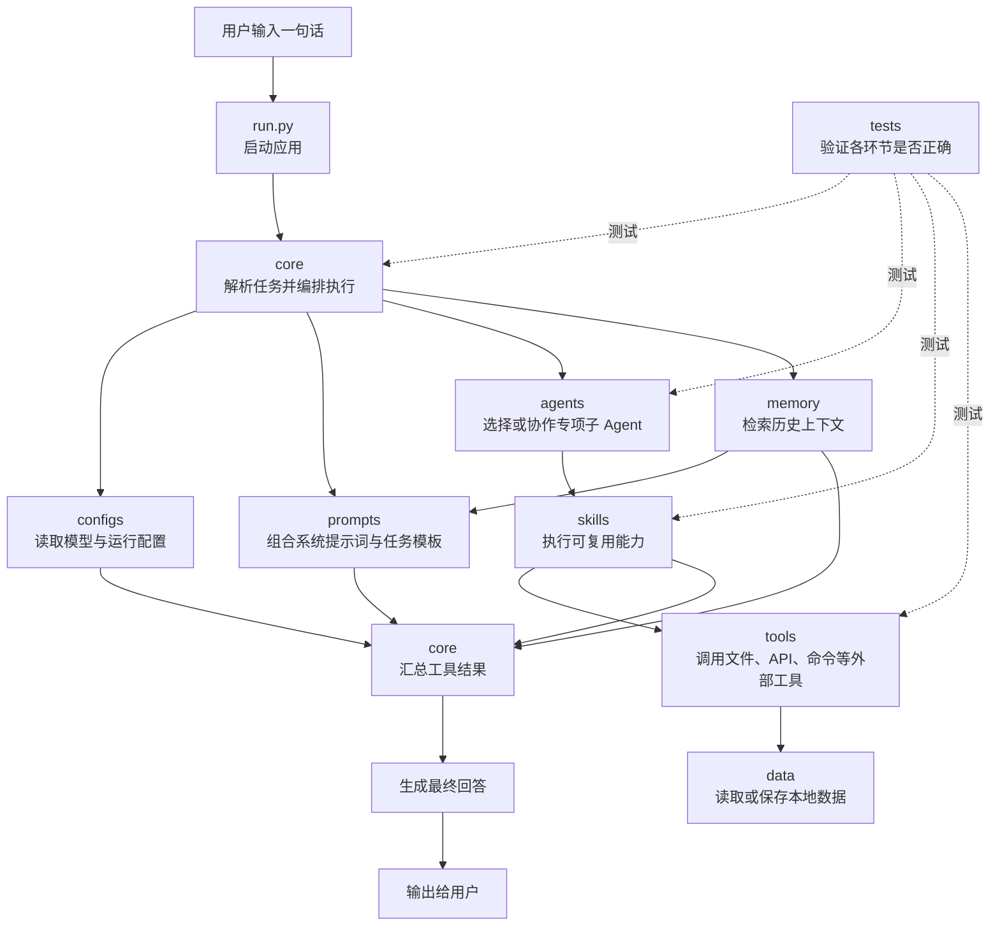

# AI Agent Zero To Hundred

一个可逐步扩展的 Python Agent 项目骨架。

## 项目架构

```text
AI-Agent-Zero-To-Hundred/
├── README.md                 # 项目说明与开发指南
├── pyproject.toml            # Python 项目、工具与测试配置
├── .env.example              # 环境变量模板（不存放真实密钥）
├── requirements.txt          # Python 依赖清单
├── run.py                    # 项目启动入口
├── agent/
│   ├── __init__.py           # Agent 包标识
│   ├── core/                 # Agent 核心循环、状态与编排逻辑
│   ├── prompts/              # 系统提示词、任务模板与输出格式
│   ├── skills/               # 可复用能力模块，如检索、总结、代码生成
│   ├── memory/               # 短期/长期记忆的读写与检索实现
│   ├── tools/                # 对外部服务、文件、命令等工具的封装
│   ├── agents/               # 专项子 Agent 与协作角色定义
│   ├── configs/              # 模型、运行参数与应用配置
│   ├── data/                 # 本地运行数据与示例数据
│   └── tests/                # 单元测试与集成测试
```

## 一句话到输出的执行流程



执行主线：用户输入 → 核心编排 → 读取配置、提示词与记忆 → 子 Agent 调用技能和工具 → 汇总结果 → 输出回答。

## 快速开始

```bash
python -m venv .venv
pip install -r requirements.txt
copy .env.example .env
python run.py
```

将 `.env` 中的 `OPENAI_API_KEY` 替换为自己的密钥后，再接入模型调用逻辑。
